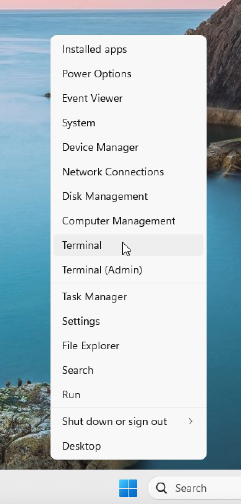
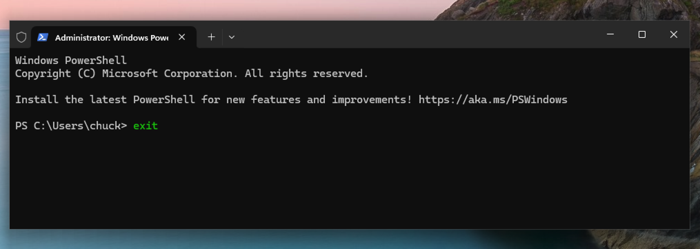
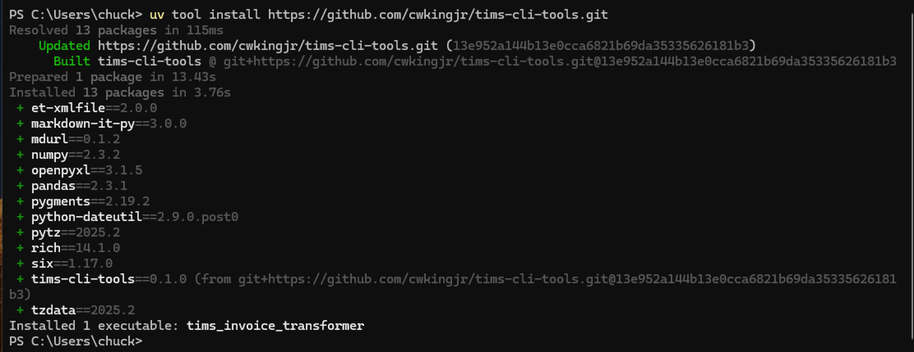
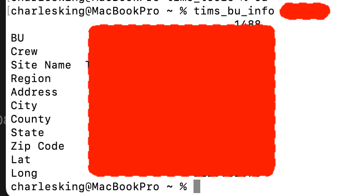
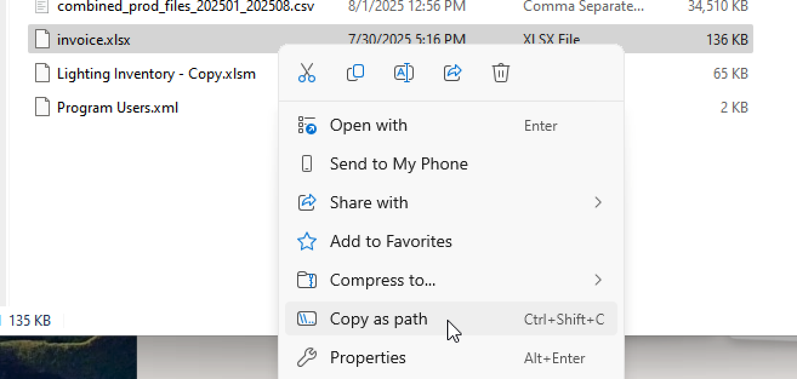

# TIMS CLI Tools

Home for some custom command line interface (CLI) tools I'm building to help some folks streamline some repetitive adminstrative tasks.

## Using the Windows PowerShell Terminal

Open the terminal by right-clicking on the Windows Start icon and choosing Terminal.

<p align="center"></p>

Exit the terminal. Type "exit" and hit return.

<p align="center"></p>

## Install Git Bash and UV and Verify Installations

You'll need git and uv installed on your computer. To get those, head over to https://github.com/cwkingjr/windows-install-gitbash-and-uv and install Git Bash and UV, then complete the verification steps there.

## Update UV

Update `uv` pretty often as it's under continous improvement development.

```bash
uv self update
```

## TIMS CLI Tools

### Install TIMS CLI Tools

Using the PowerShell or Git Bash Terminal run this command at the shell prompt:

```bash
uv tool install https://github.com/cwkingjr/tims-cli-tools.git
```

Here's what the install looked like on my system:

<p align="center"></p>

### Upgrade TIMS CLI Tools

This is typically only needed when the developer fixes bugs, adds features, or updates the program's dependencies. In any case, it doesn't hurt anything to run it just in case.

```bash
uv tool upgrade tims-cli-tools
```

Or, you can just upgrade all the tools managed by uv at once (don't include from the # on):

```bash
uv tool list # to see all the tools you have installed that are managed by uv
uv tool upgrade --all # to upgrade all the installed tools
```

### Uninstall TIMS CLI Tools

```bash
uv tool uninstall tims-cli-tools
```

## TIMS BU Info

### Description

This tool accepts a BU number as it's command line argument, looks in the master tracker spreadsheet to find that BU, grabs some of the info from that row, and prints it into the terminal screen. The idea behind this tool is to allow you to very quickly grab address and lat/long for a BU instead of having to pull up the spreadsheet and find it yourself.

### Set Up a Configuration File

This tool requires a configuration file in a hidden directory so it can read that file to discover where the master tracker spreadsheet is located.

Either grab the `tims_bu_info.toml` file from this repo or create one exactly like it from scratch with Notepad.

The file contents need to be exactly the same as the example in this repo, but with the path in quotes changed to reflect where the production master tracker spreadsheet lives.

This file must be in your home folder, under some additional folders, like this: `/Users/<your-user-name>/.config/tims_tools/tims_bu_info.toml`. That `.config` directory starts with a dot on purpose as thats a hidden folder (typically).

On Windows it's something like this: `%HOMEDRIVE%%HOMEPATH%\.config\tims_tools\tims_bu_info.toml`.

We're using this system of folders because that is convention for command line tool configs. That way, other tools can put their configs in `.config/` under a folder named for their tool, and can put whatever files they need under their folder.

If you are interested in using Git Bash, you can go into that terminal and run this command: `mkdir -p ~/.config/tims_tools/` to make those folders all at one time. Then place your modified `tims_bu_info.toml` file into that tims_tools directory/folder.

### Invoke TIMS BU Info

To run the tool, go to the Git Bash Terminal and run (`<something>` inside angle brackets indicates this is something your are supposed to replace, replacing angles and all; meaning, leave out the angles.):

```bash
tims_bu_info <bu number>
tims_bu_info 4746458576
```

Example output:

<p align="center"></p>

## TIMS Invoice

The tims_invoice tool reads a spreadsheet extracted from the master tracing spreadsheet, grabs the columns it needs, and generates an output spreadsheet with the data transformed into the format required for pasting into a specific third party's invoice submission spreadsheet.

Invoke the tool and pass it the path as to the extract spreadsheet. You'll love your life more if you don't put spaces in your file names.

```bash
tims_invoice(.exe) <your_file_path.xlsx>
```

Unix/Linux Example:

```bash
tims_invoice Z:/invoice.xlsx
```

Windows Example:

```bash
tims_invoice.exe Z:/invoice.xlsx
```

If you are not very good at moving around the terminal yet, get yourself an intro over at https://github.com/cwkingjr/unix-command-intro-for-windows-folks or just grab the path to the file you want to process via the Windows File Explorer and paste it in after the program command and one space on the command line.

Grabbing the path via the Windows File Explorer:

<p align="center"></p>

## Using a Windows BAT File

If you would like to use a Windows Batch file to allow file drag and drop from the Windows Explorer to a batch file, have a look over at `https://github.com/cwkingjr/windows-drag-to-app-with-args` to see how to set up a batch file.

Assuming `uv` installed this app on your system in the same general location as it did on mine, you can just copy the `tims_invoice.bat` file in this repository onto your desktop and it should work. If using the one provided here doesn't work, you should be able to figure out the issue using that link provided just above.
